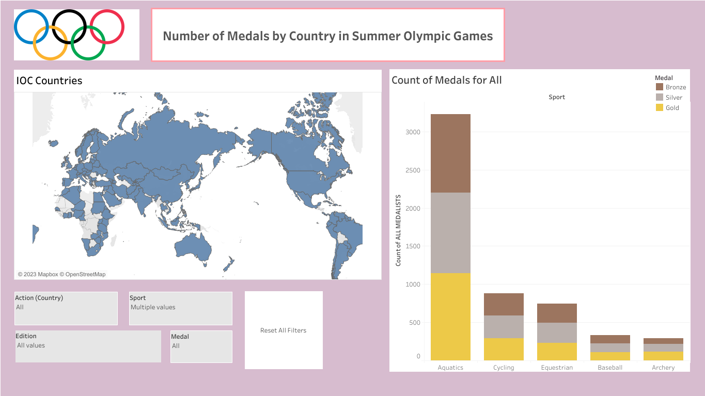
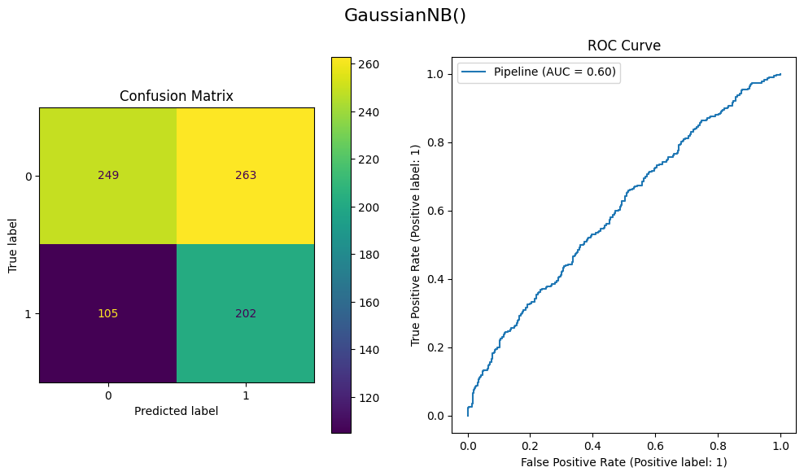

# Project_Portfolio

This is the repository for my project portfolio

## Here's My [guideline](https://github.com/leedh7878/DanielLee_Project_Portfolio/blob/main/References/page_organization) for how I organized the repositories: 

# Project description:

## [Project 1. Power BI Project: Maven Coffee Challenge ("The Great American Coffee Taste Test")](https://mavenanalytics.io/project/13111)

- Employ Power Query for comprehensive data transformation, including cleaning, pivoting, and merging operations.

- Normalized a substantial dataset from a single file, comprising multiple tables, and established a coherent data model complete with relationships.

- Generated explicit measures using DAX functions.

- Designed an interactive report providing a comprehensive overview of data from "The Great American Coffee Taste Test."

- Created visuals including matrices, bar charts, donut charts, treemaps, and decomposition trees.

Data Source: https://mavenanalytics.io/challenges/maven-coffee-challenge/30

## [Project 2. Maternal Health Analysis with R programming](https://public.tableau.com/app/profile/donghyun6358/viz/Personal_Project_16906002812120/Dashboard1)

Data Source: https://public.tableau.com/app/resources/sample-data

## [Project 3. Water Quality: ](https://github.com/leedh7878/DanielLee_Project_Portfolio/blob/main/Water_Quality_Potability/src/water_quality.ipynb)

Data source: https://www.kaggle.com/datasets/uom190346a/water-quality-and-potability

- Imputation and oversampling techniques have been applied for the first time, although their impact on the data outcome remains uncertain.

- Various classification methods have been utilized to assess the accuracy of predictions.

- ROC curves and confusion matrices have been generated for visualization.

## [Project 4. SQL Application: Build an application utilizing Yelp data through effective SQL implementation](https://github.com/leedh7878/DanielLee_Project_Portfolio/tree/main/Yelp_Data)

 - Build an ETL pipeline for transforming JSON files into SQL data.

 - [Design the Database schema](https://github.com/leedh7878/DanielLee_Project_Portfolio/tree/main/Yelp_Data/DBSchema)

 - The database generates new aggregate data, including sums and counts, derived from the existing dataset

 - The user interface, built with PyQt5, will display both aggregated data and the complete dataset.

## [Project 5. R Project: Shiny app to visualize precipitation data in Washington State](https://github.com/leedh7878/DanielLee_Project_Portfolio/tree/main/NOAA_Shinyapp)

[Click on this link to access the Shiny application](https://leedh7878.shinyapps.io/NOAA_Shinyapp/)

- Develop a Shiny app to access and efficiently present precipitation data for weather stations in Washington State, sourced from the NOAA API

- Enable users to choose a specific year from the available range of 2000 to 2003.

- Provide an interactive interface to visualize the monthly precipitation data for the selected year.

- Implement a bar graph that highlights the top 5 areas (stations) with the highest recorded precipitation levels.

## [Project 6. NLP Python Project: College students' food and cooking preferences:](https://github.com/leedh7878/DanielLee_Project_Portfolio/blob/main/Food_Choice/src/Food_Choice_%20Data_Cleansing.ipynb)

- Engaging in a Python project focused on tasks such as data cleaning, natural language processing, and exploratory data analysis.

- The NLTK package was employed to optimize natural language processing.

- Create a grammar to extract food item names from unformatted strings and present them in a list format.

Data Source: https://www.kaggle.com/datasets/borapajo/food-choices- 

## [Project 7. 2nd SQL Personal Project: Bike ](https://github.com/leedh7878/DanielLee_Project_Portfolio/tree/main/Bike_Store_Relational_Database_SQL)

[ER Diagram:](https://github.com/leedh7878/DanielLee_Project_Portfolio/tree/main/Bike_Store_Relational_Database_SQL/src/ER_diagram.jpg)

## [Project 8. Tableau Project: Olympic Medalist](https://public.tableau.com/app/profile/donghyun6358/viz/Personal_Project_16906002812120/Dashboard1)

- The objective of this project is to visualize the number of medals earned in the Olympics.

- Users can select a country directly from the map.

- Dropdown filters are available for country, medal type, and sport types.

- The year of the Olympics can be chosen using a slider.

- A reset button is provided to clear applied filters and reset the display.

- The bar graph will provide a clear and concise overview of medal counts based on the selected filters.

Data Source: https://public.tableau.com/app/resources/sample-data

Refresh the page if the images are not displayed
